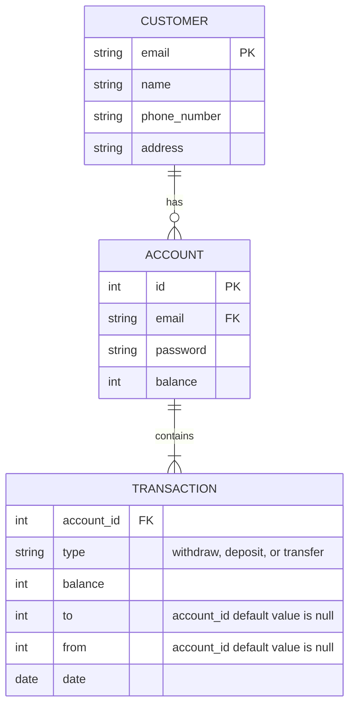

# Basic Banking System ERD

```mermaid
erDiagram
    CUSTOMER ||--o{ ACCOUNT : has
    CUSTOMER {
        string email  PK
        string name
        string phone_number
        string address
    }
    ACCOUNT ||--|{ TRANSACTION : contains
    ACCOUNT {
        int id  PK
        string email  FK
        string password
        int balance
    }
    TRANSACTION {
        int account_id FK
        string type "withdraw, deposit, or transfer"
        int balance
        int to "account_id default value is null"
        int from "account_id default value is null"
        date date
    }

```