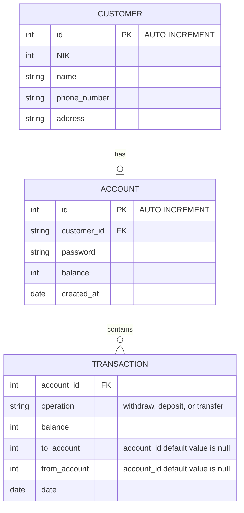

# Basic Banking System ERD
**Brief overview**\
visual representation of the relationships between different entities in a database or system. It helps in understanding the structure and relationships between different components.

There are three entities: CUSTOMER, ACCOUNT, and TRANSACTION. Each entity represents a different type of object or concept in the system.

- The CUSTOMER entity represents a customer. It has attributes like nik, name, phone number, and address. Each customer is identified by their id.
- The ACCOUNT entity represents a bank account. It has attributes like customer_id, password, balance, and when the account was created. Each account is connected to a specific customer through customer_id.
- The TRANSACTION entity represents an action happening in the system, such as a deposit or withdrawal. It has attributes like the account involved, the type of action, the amount, and the date.

The relationships between these entities are as follows:

- A customer can only have a bank accounts. This is represented by the "has" relationship between CUSTOMER and ACCOUNT.
- A transaction is associated with a specific account. This is represented by the "contains" relationship between ACCOUNT and TRANSACTION.
In summary, the ERD shows the entities and their relationships. The CUSTOMER entity has multiple ACCOUNT entities, and each ACCOUNT entity has multiple TRANSACTION entities.
